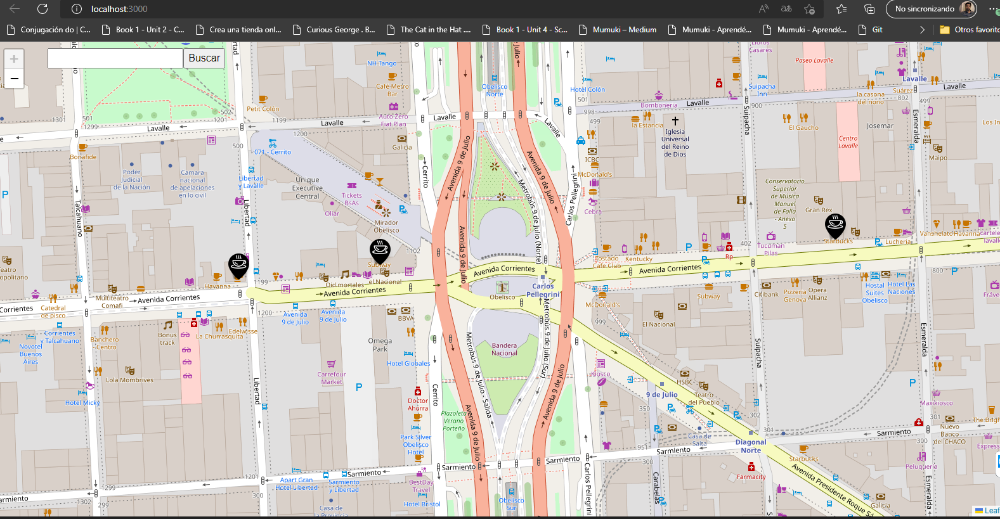

<h1 align="center">A la vuelta del mejor Café</h1>

## Sobre el Proyecto
 
### Aplicacion web que permite buscar un café a tu medida basado en los comentarios de otros apasionados por el cafe. Podrás dejar tus comentarios para ayudar a otras personas a encontrar el café que buscan. 
### La aplicación propone presentar un mapa con las cafeterías registradas y valoradas donde el usuario pueda visualizar las cafeterias cercanas y los comentarios de las mismas para poder decidir cual consumir.

   
  

## Stack Utilizado
La aplicación se realiza utilizando MERN Stack
* [MongoDB](https://mongodb.com/)
* [Express](https://expressjs.com/)
* [React](https://es.reactjs.org/)
* [Nodejs](https://nodejs.dev/en/)

## Integrantes:

- Mariana Ingrid Calle
- Kenny J. Luque
- Diego Nicita
- Ezequiel Sanchez
- Ariel Cuello
- Gonzalo Cubillas

## Trello:

https://trello.com/b/YN2YyggU/nocountry-selecccionado-4
